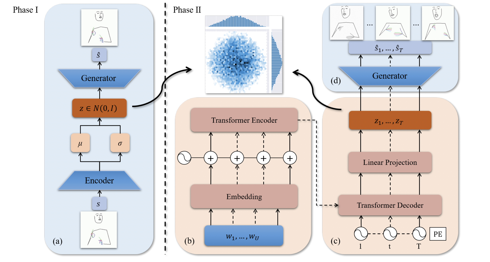

# NSLP-G

This is repository for NSLP-G.
Pytorch implementation of the paper [**"Non-Autoregressive Sign Language
Production with Gaussian Space"**](https://www.bmvc2021-virtualconference.com/assets/papers/1102.pdf), [BMVC 2021](https://www.bmvc2021-virtualconference.com).



#### Bibtex
If you find this code useful in your research, please cite:

```
@inproceedings{hwang2021non,
  title={Non-Autoregressive Sign Language Production with Gaussian Space},
  author={Hwang, Euijun and Kim, Jung-Ho and Park, Jong-Cheol},
  booktitle={The 32nd British Machine Vision Conference (BMVC 21)},
  year={2021},
  organization={British Machine Vision Conference (BMVC)}
}
```

## Installation :construction_worker:
### 1. Create conda environment
```
conda env create -f environment.yml
conda activate nslp
```

### 2. Download the datasets
Please download dataset from
[Phoenix14-T](https://www-i6.informatik.rwth-aachen.de/~koller/RWTH-PHOENIX-2014-T/) and 
[How2Sign](https://how2sign.github.io/)

Note: The data classes are implemented in ```scripts/data.py```, but you can create your own.

## How to use NSLP-G
#### Training Spatial VAE
```bash
python scripts/train_spavae.py \
    --accelerator gpu --devices 0 \
    --num_worker 8 --batch_size 64 \
    --dataset_type {DATASET_TYPE} \
    --train_path {TRAIN_PATH} \
    --valid_path {VALID_PATH} \
    --test_path {TEST_PATH}
```
#### Training NonAutoregressive SLP
```bash
python scripts/train_nslpg.py \
    --accelerator gpu --devices 0 \
    --num_worker 8 --batch_size 64 \
    --vae_ckpt {PRETRAINED_VAE_CKPT} \
    --dataset_type {DATASET_TYPE} \
    --train_path {TRAIN_PATH} \
    --valid_path {VALID_PATH} \
    --test_path {TEST_PATH}
```